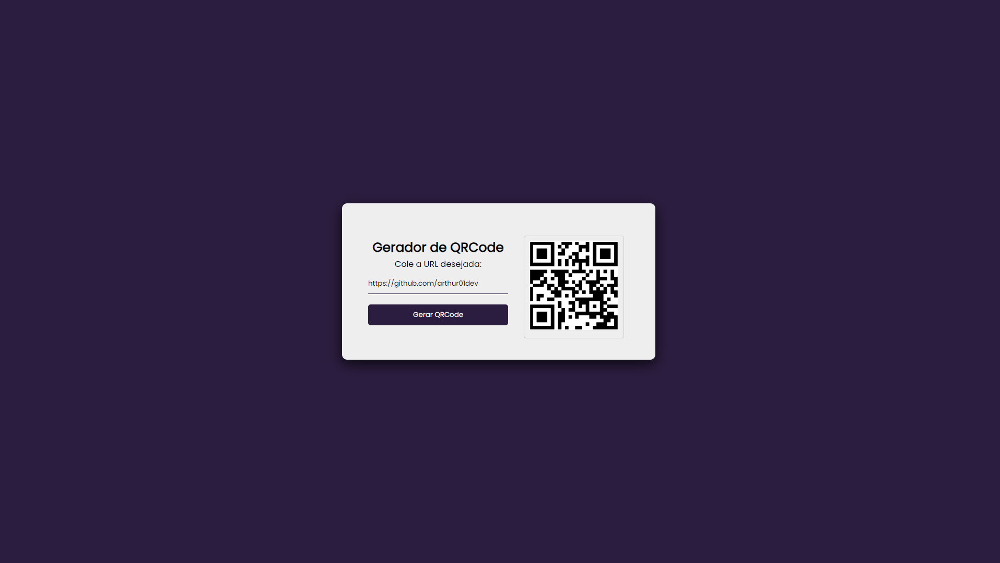

<h1 align="center"> QRExpress - Gerador de QR Code Web</h1>

Bem-vindo ao QRExpress, um projeto open source que oferece uma solução simples e eficiente para a geração de QR Codes diretamente no navegador. Desenvolvido com HTML, CSS e JavaScript, este gerador utiliza uma API para proporcionar uma experiência rápida e confiável na criação de códigos QR personalizados. 

  <a href="#-tecnologias">Tecnologias</a>
  
 

  

## 🚀 Tecnologias

Esse projeto foi desenvolvido com as seguintes tecnologias:

- HTML: Estruturação da página web.
- CSS: Estilização para uma experiência visual atraente.
- JavaScript: Lógica de programação para interação e geração dinâmica.
- Git: Controle de versão para o gerenciamento do código-fonte.
- GitHub: Plataforma de hospedagem de código-fonte e colaboração.
- API de QR Code: Integração de uma API para a criação eficiente dos códigos.

## 